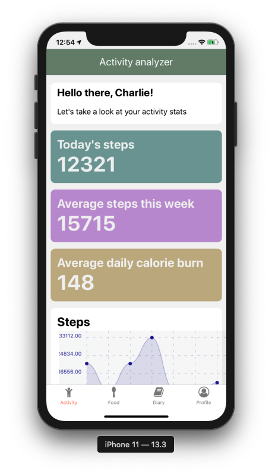
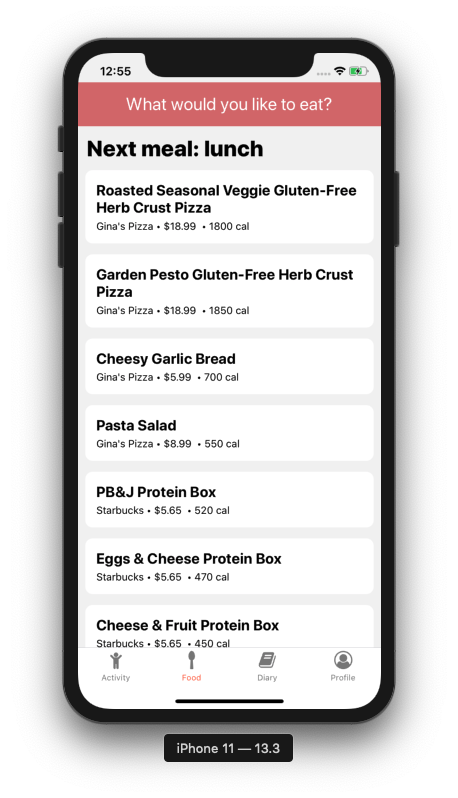

# Stay Healthy UCI

Project created for CS 125 Winter 2020.

Food diary based application that recommends meals and restaurants based on activity data (from Apple Healthkit) and dietary restrictions. Food consumption habits are learned and taken into account during the recommendation process. All meals and restaurants are curated and located near the UC Irvine campus.

App built using React Native. Food data accessed using AWS DynamoDB, AWS Lambda, and AWS API Gateway.

  


## API Endpoint

Meals endpoint: https://gb6o73460i.execute-api.us-west-2.amazonaws.com/prod/meals

Sample POST request:
```
{
	"tags": ["vegan", "lunch"]
	"minCalories": 0,
	"maxCalories": 500
}
```

